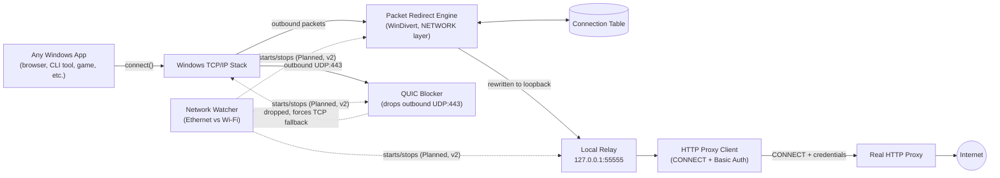
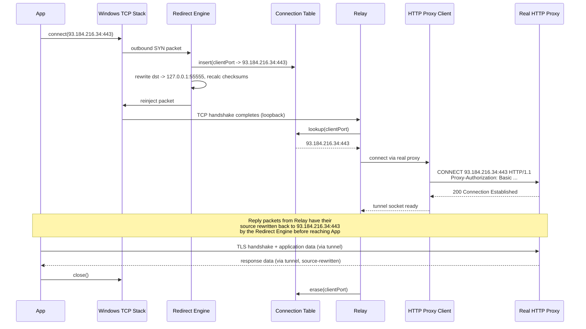
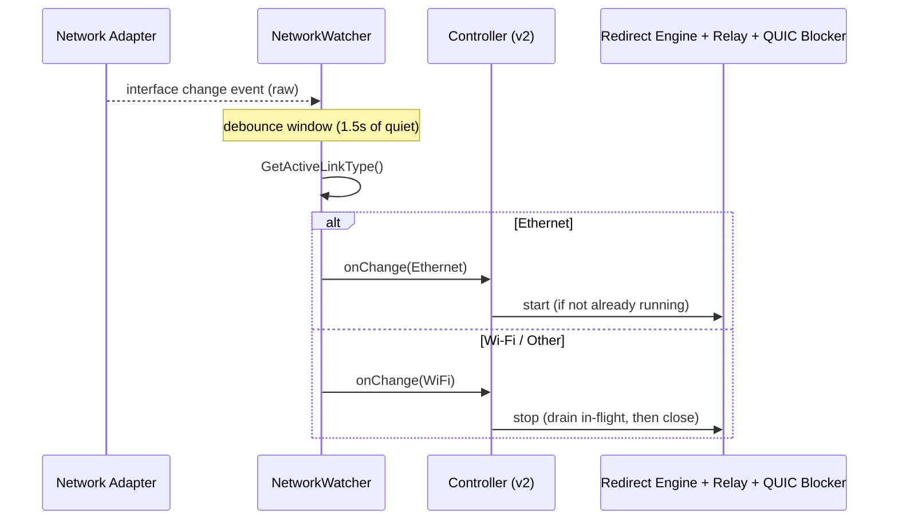

# Product Requirements Document: ProxyBridge
> A network-aware, transparent HTTP proxy redirector for Windows

| Field | Value |
| :--- | :--- |
| **Document status** | Draft |
| **Version** | 1.0 |
| **Date** | 2026-08-01 |
| **Author** | Product/Engineering (solo project) |
| **Platform** | Windows 10/11, x64 |
| **Related repos** | `proxifier-lite/`, `net-proxy-toggle/` |

---

## Table of Contents
- [1. Overview](#1-overview)
- [2. Problem Statement](#2-problem-statement)
- [3. Goals](#3-goals)
- [4. Non-Goals (v1)](#4-non-goals-v1)
- [5. Target User](#5-target-user)
- [6. System Architecture](#6-system-architecture)
  - [6.1 Component diagram](#61-component-diagram)
  - [6.2 Design principle](#62-design-principle)
  - [6.3 Why not the OS proxy setting?](#63-why-not-the-os-proxy-setting)
- [7. Component Specifications](#7-component-specifications)
  - [7.1 Packet Redirect Engine — packet_engine.cpp / .h](#71-packet-redirect-engine--packet_enginecpp--h)
  - [7.2 Connection Table — conn_table.h](#72-connection-table--conn_tableh)
  - [7.3 Local Relay — relay.cpp / .h](#73-local-relay--relaycpp--h)
  - [7.4 HTTP Proxy Client — http_proxy_client.cpp / .h](#74-http-proxy-client--http_proxy_clientcpp--h)
  - [7.5 SOCKS5 Client — socks5_client.cpp / .h](#75-socks5-client--socks5_clientcpp--h)
  - [7.6 QUIC Blocker — quic_blocker.cpp / .h](#76-quic-blocker--quic_blockercpp--h)
  - [7.7 Configuration — config.h / .cpp](#77-configuration--configh--cpp)
  - [7.8 Network Watcher — network_watcher.h / .cpp](#78-network-watcher--network_watcherh--cpp)
  - [7.9 System Proxy Settings Manager — proxy_settings.h / .cpp](#79-system-proxy-settings-manager--proxy_settingsh--cpp)
  - [7.10 Integration Layer — Planned (v2)](#710-integration-layer--planned-v2)
- [8. Functional Requirements](#8-functional-requirements)
- [9. Non-Functional Requirements](#9-non-functional-requirements)
- [10. Sequence Diagrams](#10-sequence-diagrams)
  - [10.1 Single connection, end-to-end](#101-single-connection-end-to-end)
  - [10.2 Network transition (Planned, v2)](#102-network-transition-planned-v2)
- [11. Configuration Reference](#11-configuration-reference)
- [12. API / Module Reference](#12-api--module-reference)
- [13. Security Considerations](#13-security-considerations)
- [14. Known Limitations](#14-known-limitations)
- [15. Risks & Assumptions](#15-risks--assumptions)
- [16. Testing & Validation Plan](#16-testing--validation-plan)
- [17. Deployment](#17-deployment)
- [18. Roadmap (v2+)](#18-roadmap-v2)
- [19. File Manifest](#19-file-manifest)
- [20. Glossary](#20-glossary)
- [21. References](#21-references)

---

## 1. Overview
ProxyBridge makes every application on a Windows machine send its internet traffic through a credential-protected HTTP proxy, without any application being aware a proxy exists at all — no proxy configuration dialog, no credential prompt, no restart. It also turns itself on and off automatically based on which network the machine is using (wired vs. wireless), so it's only active when it's supposed to be.

It's composed of two purpose-built tools, designed to eventually operate as one system:
- **`proxifier-lite`** — the redirect engine. Intercepts outbound TCP at the packet level (below any application's own network stack), reroutes it through a local relay, and that relay authenticates to the real proxy on the application's behalf.
- **`net-proxy-toggle`** — the network-awareness layer. Watches which network adapter is actually carrying traffic and reacts to changes in real time.

This document specifies both as-built (v1, status: Implemented) and the integration work to unify them (status: Planned, see [§18](#18-roadmap-v2)).

---

## 2. Problem Statement
Standard approaches to "make my apps use this proxy" all have gaps:

| Approach | Problem |
| :--- | :--- |
| **Configure each app's own proxy settings** | Tedious, inconsistent across apps, many apps have no proxy setting at all |
| **Set the Windows system proxy (Settings → Proxy)** | Only respected by apps that read it; several Chromium-based and cached-config apps don't pick up changes without a restart |
| **Proxy requires a username/password** | Apps that do respect a system/app-level proxy setting will pop up an OS or in-app credential dialog — friction, and not automatable |
| **Manually switch proxy on/off per network** | Easy to forget when moving between Ethernet and Wi-Fi; leftover proxy settings break Wi-Fi browsing, or traffic silently isn't proxied on Ethernet |
| **Modern browsers prefer QUIC (HTTP/3 over UDP)** | Any redirect mechanism that only understands TCP is silently bypassed for a growing share of real-world traffic |

ProxyBridge exists to close all of these gaps at once, at the lowest layer that reasonably solves the problem (the OS network stack, not the application layer).

---

## 3. Goals
| ID | Goal |
| :--- | :--- |
| **G1** | Redirect all outbound TCP traffic transparently through a real HTTP proxy that requires Basic authentication |
| **G2** | Applications never see a proxy — no configuration, no credential prompt, no code changes, no restart, ever |
| **G3** | Automatically enable when the active network is Ethernet, disable otherwise, with no manual intervention |
| **G4** | Minimize traffic that leaks around the proxy (in particular, QUIC/UDP:443) |
| **G5** | No GUI required — config-file-driven, suitable for running as a background process |
| **G6** | Proxy credentials are never exposed via command-line arguments, process listings, or logs |
| **G7** | The system degrades safely: if the proxy is unreachable or credentials are wrong, affected connections fail cleanly rather than silently going direct or hanging indefinitely |

---

## 4. Non-Goals (v1)
Explicitly out of scope for the version described in this document:
- Per-application selective proxying (choosing which `.exe` gets redirected) — see [Roadmap](#18-roadmap-v2)
- IPv6 traffic
- UDP traffic in general, including DNS (port 53) — DNS resolution happens outside the proxy in v1
- NTLM or Kerberos proxy authentication — Basic auth only
- macOS or Linux support
- A GUI or system tray application
- Packaging as a signed, installable Windows Service
- Multi-user / multi-machine deployment or central management

---

## 5. Target User
A single developer/power user running Windows 10/11, who has administrator rights on their own machine, and needs their own traffic routed through a proxy that requires a username and password — most commonly a corporate or personally-run HTTP proxy. Not designed for distribution to non-technical end users or for managing other people's machines.

---

## 6. System Architecture

### 6.1 Component diagram



### 6.2 Design principle
Every mechanism in this system operates below the application layer — at the kernel-driver-mediated packet layer, not at any configuration surface an application reads. This is what makes "no restart, ever" true by construction rather than by best-effort synchronization: there is no cached setting for an app to be out of sync with.

### 6.3 Why not the OS proxy setting?
`net-proxy-toggle` (the WinINet/registry-based approach) was built first and is kept in the system, but it is not the primary enforcement mechanism — some apps cache WinINet settings per-process and don't reliably pick up changes without restarting. It remains useful as a secondary signal for apps that specifically introspect the OS-reported proxy setting, and as the source of network-change detection reused by the v2 integration.

---

## 7. Component Specifications

### 7.1 Packet Redirect Engine — `packet_engine.cpp` / `.h`
- **Status:** Implemented
- **Responsibility:** Intercept every outbound TCP packet at the Windows network-driver level, and implement a hand-built NAT so that connections are silently redirected to the local relay and back.
- **Mechanism:**
  - Opens a `WINDIVERT_LAYER_NETWORK` handle via `WinDivertOpen()`.
  - Filter: `tcp and ((outbound and !loopback) or (outbound and loopback and tcp.SrcPort == <relay port>))`.
  - On the first packet (`SYN`, not `ACK`) of a new flow, records `client_port → (original_dst_ip, original_dst_port)` in the Connection Table.
  - Rewrites the packet's destination to `127.0.0.1:<relay port>` and reinjects it via `WinDivertSend()`; repeats for every subsequent packet of that flow (the OS regenerates each one addressed to the original destination, so every single packet needs correcting, not just the `SYN`).
  - For the return leg (relay → app), rewrites the packet's source address back to the original destination, using the same table, keyed by destination port on that leg.
  - Uses `WinDivertHelperCalcChecksums()` after every modification.
  - **Known WinDivert-specific detail:** loopback traffic is reported as `Outbound=1` in both logical directions — there is no `Inbound=1` capture point for loopback packets. Both legs of the app↔relay conversation are therefore distinguished by inspecting header contents (which side is the relay port), not by the `Direction` flag.
- **Threading:** Runs on its own thread (or the main thread); blocks indefinitely inside the capture loop. A background sweep thread purges stale Connection Table entries every 30 seconds (entries older than 5 minutes with no traffic).
- **Requirements:** Must run elevated (Administrator) — `WinDivertOpen()` installs the WinDivert kernel driver on first use and requires it.

### 7.2 Connection Table — `conn_table.h`
- **Status:** Implemented
- **Responsibility:** Thread-safe in-memory map from a client's local TCP port to the original destination it was trying to reach.

| Operation | Behavior |
| :--- | :--- |
| `insert(clientPort, dstAddr, dstPort)` | Adds/overwrites an entry, network-byte-order values |
| `lookup(clientPort, &dstAddr, &dstPort)` | Returns true/false; refreshes the entry's last-seen time on hit |
| `erase(clientPort)` | Removes an entry (called when a relayed connection fully closes) |
| `sweepStale(maxAge)` | Removes any entry not touched within `maxAge` (background hygiene for crashed/ungracefully-closed flows) |

Keyed by client port because it's unique for the lifetime of one TCP connection and appears in the header of both legs of the redirected flow.

### 7.3 Local Relay — `relay.cpp` / `.h`
- **Status:** Implemented
- **Responsibility:** Accept the now-locally-redirected connection, recover the original destination, and bridge the app to the real destination via the HTTP proxy client.
- **Mechanism:**
  - Listens on `127.0.0.1:<relay port>`.
  - For each accepted connection: reads the peer's port via `getpeername()`, looks it up in the Connection Table.
  - Calls `HttpProxyConnect()` to establish the authenticated upstream tunnel.
  - Spawns two threads to pump bytes in each direction until either side closes (`PumpOneDirection`), then closes both sockets and erases the Connection Table entry.
- **Threading model:** One thread per accepted connection, plus two pump threads per connection for the duration of its life. Acceptable for personal/low-concurrency use; see [§9](#9-non-functional-requirements) for scaling notes.

### 7.4 HTTP Proxy Client — `http_proxy_client.cpp` / `.h`
- **Status:** Implemented
- **Responsibility:** Speak the real proxy's protocol on the app's behalf, including authentication, so nothing upstream of the relay ever has to.
- **Mechanism:**
  - Opens a TCP connection to the configured proxy.
  - Sends `CONNECT <ip>:<port> HTTP/1.1` with a preemptive `Proxy-Authorization: Basic <base64(username:password)>` header (Basic auth is not challenge-based, so credentials are sent up front rather than waiting for a 407).
  - Reads the response status line and headers byte-by-byte (not bulk-buffered) to avoid over-reading into the tunnel's actual data stream.
  - Treats `HTTP 200` as success; anything else is a failure (bad credentials, proxy policy rejection, etc.) and the socket is closed.
  - **Known limitation:** the CONNECT target is always an IP literal, never a hostname — packet-layer interception never sees DNS. Proxies that do domain-based allow/deny filtering on the CONNECT target may reject otherwise-correctly-authenticated requests.

### 7.5 SOCKS5 Client — `socks5_client.cpp` / `.h`
- **Status:** Implemented, not wired in by default
- Kept as an alternate backend for a SOCKS5 upstream proxy (no-auth method only, in the current implementation). Swappable into `relay.cpp` in place of `HttpProxyConnect()` if ever needed.

### 7.6 QUIC Blocker — `quic_blocker.cpp` / `.h`
- **Status:** Implemented
- **Responsibility:** Prevent QUIC-capable applications (Chrome, Edge, and increasingly others) from silently bypassing the TCP-only redirect by using HTTP/3 over UDP instead.
- **Mechanism:** A second, independent `WINDIVERT_LAYER_NETWORK` handle with filter `outbound and udp and udp.DstPort == 443`. Matching packets are simply never reinjected (dropped). QUIC-capable clients treat this as "QUIC unavailable" and transparently retry over TCP:443, which the redirect engine does catch. No app-visible error.

### 7.7 Configuration — `config.h` / `.cpp`
- **Status:** Implemented
- **Responsibility:** Load proxy connection details and credentials from a local file, never from command-line arguments (which are visible in the process list and shell history).
- **Format:** simple `key=value` text file, `#` for comments. See [§11](#11-configuration-reference) for the full field reference.

### 7.8 Network Watcher — `network_watcher.h` / `.cpp`
- **Status:** Implemented (in `net-proxy-toggle`), not yet wired into `proxifier-lite`
- **Responsibility:** Determine which adapter is currently carrying the default route, classify it (Ethernet / Wi-Fi / Other / Unknown), and react live to changes.
- **Mechanism:**
  - `GetActiveLinkType()`: calls `GetBestInterface()` against a dummy destination to find the interface index actually used for routing (not merely "is up"), then cross-references `GetAdaptersAddresses()` for that index's `IfType` (`IF_TYPE_ETHERNET_CSMACD` vs `IF_TYPE_IEEE80211`).
  - `NetworkWatcher` class: registers a callback via `NotifyIpInterfaceChange()`, which fires (from its own OS-managed thread, no message pump required) on any interface state change.
  - **Debounces:** a background thread polls every 300ms and only fires `onChange()` once 1,500ms have passed with no further raw events — network transitions tend to generate bursts of intermediate-state events.

### 7.9 System Proxy Settings Manager — `proxy_settings.h` / `.cpp`
- **Status:** Implemented (in `net-proxy-toggle`)
- **Responsibility:** Set/clear the Windows WinINet system proxy (`HKCU\...\Internet Settings`), and broadcast the change via `InternetSetOption(INTERNET_OPTION_SETTINGS_CHANGED / INTERNET_OPTION_REFRESH)` so already-running WinINet-based apps notice without restarting. Documented limitation: not all apps honor this reliably (see [§6.3](#63-why-not-the-os-proxy-setting)).

### 7.10 Integration Layer — Planned (v2)
- **Status:** Planned, not yet implemented
- **Goal:** `NetworkWatcher` should directly start/stop the redirect engine (`packet_engine` + `relay` + `quic_blocker`) rather than (or in addition to) toggling the WinINet setting.
- **Required changes:**
  - `RunPacketEngine()` and `RunQuicBlocker()` currently block forever inside their capture loops with no exit path. They need a cancellation mechanism — e.g. calling `WinDivertClose()` on the handle from a controller thread to unblock a pending `WinDivertRecv()` with an error, which the loop then treats as a shutdown signal rather than "retry."
  - `RunRelay()`'s listening socket needs a similar shutdown path (`closesocket()` the listener from the controller thread to unblock `accept()`).
  - On stop, in-flight connections should be allowed to drain rather than be killed outright, where practical.
  - The debounce behavior already in `NetworkWatcher` should directly govern start/stop calls, to avoid thrashing the engine on flappy network transitions.

---

## 8. Functional Requirements
> Status legend: Impl = Implemented, Plan = Planned.

| ID | Requirement | Priority | Status |
| :--- | :--- | :--- | :--- |
| **FR-1** | The system MUST intercept outbound TCP connections at the OS network-driver level, before any application-level proxy configuration is consulted | Must | Impl |
| **FR-2** | The system MUST redirect intercepted connections to a local relay without terminating or resetting the originating application's socket | Must | Impl |
| **FR-3** | The relay MUST recover the original intended destination for each redirected connection | Must | Impl |
| **FR-4** | The relay MUST establish an authenticated tunnel to the configured HTTP proxy using `CONNECT` + `Proxy-Authorization: Basic` | Must | Impl |
| **FR-5** | Proxy credentials MUST be loaded from a local config file, never from command-line arguments | Must | Impl |
| **FR-6** | The system MUST relay bytes bidirectionally between the application and the real destination for the life of the connection | Must | Impl |
| **FR-7** | The system MUST clean up Connection Table entries when a redirected connection closes, and MUST also reclaim entries left behind by ungraceful closes (crash, missed FIN) via periodic sweep | Must | Impl |
| **FR-8** | The system MUST NOT redirect its own relay's outbound connection to the real proxy (loop prevention) | Must | Impl |
| **FR-9** | The system MUST drop outbound UDP:443 (QUIC) system-wide to prevent bypass of the TCP-only redirect | Should | Impl |
| **FR-10** | The system MUST determine which network adapter currently carries the default route, not merely which adapters are "up" | Must | Impl |
| **FR-11** | The system MUST classify the active adapter as Ethernet, Wi-Fi, or Other | Must | Impl |
| **FR-12** | The system MUST react to network changes without polling on a fixed short interval, and MUST debounce bursts of transitional events | Should | Impl |
| **FR-13** | The system SHOULD start the redirect engine automatically when Ethernet becomes the active adapter, and stop it otherwise | Should | Plan |
| **FR-14** | Stopping the redirect engine MUST NOT require killing the host process or leave applications with connections pointed at a dead relay indefinitely | Should | Plan |
| **FR-15** | The system MUST require Administrator privileges to run, and MUST fail with a clear error message if not elevated | Must | Impl |
| **FR-16** | The system SHOULD support falling back to a SOCKS5 upstream proxy instead of HTTP CONNECT, via a code-level swap | Could | Impl |

---

## 9. Non-Functional Requirements

| Category | Requirement |
| :--- | :--- |
| **Performance** | Packet processing must not introduce perceptible latency for interactive use (target: sub-millisecond per-packet overhead in the rewrite path; not formally benchmarked in v1). One-packet-at-a-time `WinDivertRecv/Send` is acceptable at personal-use traffic volumes; `WinDivertRecvEx/SendEx` batching is a v2 candidate if throughput becomes a bottleneck. |
| **Reliability** | A proxy authentication failure or connectivity failure for one connection must not affect other in-flight or future connections. The engine itself must not crash on malformed or unexpected packets — parse defensively and pass through unmodified on anything not confidently understood. |
| **Concurrency** | Thread-per-connection is acceptable at expected personal-use scale (tens of concurrent connections). Not designed or tested for hundreds+ of simultaneous connections. |
| **Security** | See [§13](#13-security-considerations). |
| **Compatibility** | Windows 10/11 x64. `NotifyIpInterfaceChange`/`GetAdaptersAddresses` require Vista+ (non-issue). WinDivert 2.2.x driver compatibility per its own supported OS list. |
| **Observability** | Console logging only in v1 (stderr/stdout). No structured logging, no persistence of logs, no telemetry. |
| **Maintainability** | Each concern (packet rewrite, connection tracking, relay, proxy auth, network detection) lives in its own translation unit with a narrow header-declared interface, so backends (e.g. SOCKS5 vs HTTP, Ethernet-detection strategy) can be swapped without touching unrelated code. |

---

## 10. Sequence Diagrams

### 10.1 Single connection, end-to-end



### 10.2 Network transition (Planned, v2)



---

## 11. Configuration Reference
File: `proxy-config.txt` (path overridable via first CLI argument to `proxifier-lite.exe`; template at `proxy-config.example.txt`).

| Key | Required | Type | Description |
| :--- | :--- | :--- | :--- |
| `proxy_ip` | Yes | IPv4 address | Real HTTP proxy's address |
| `proxy_port` | Yes | uint16 | Real HTTP proxy's port |
| `proxy_user` | No* | string | Basic auth username |
| `proxy_pass` | No* | string | Basic auth password |
| `relay_port` | No | uint16 | Local loopback listener port (default 55555) |

_\* Functionally required if the proxy enforces auth, which is the assumed v1 scenario; the file format does not currently reject a missing proxy_user/proxy_pass at load time._

**Handling:** Read once at process startup via `LoadConfigFromFile()`. Not hot-reloaded — a config change requires restarting `proxifier-lite.exe` itself (this is the one place in the system where a restart is expected; it is the tool's own restart, not any redirected application's).

---

## 12. API / Module Reference

| Module | Key function | Signature (essentials) |
| :--- | :--- | :--- |
| `packet_engine` | `RunPacketEngine` | `void RunPacketEngine(ConnTable&, const Config&)` — blocking |
| `conn_table` | `insert` / `lookup` / `erase` / `sweepStale` | See [§7.2](#72-connection-table--conn_tableh) |
| `relay` | `RunRelay` | `void RunRelay(ConnTable&, const Config&)` — blocking |
| `http_proxy_client` | `HttpProxyConnect` | `SOCKET HttpProxyConnect(const std::string& proxyIp, uint16_t proxyPort, const std::string& username, const std::string& password, uint32_t targetAddrNet, uint16_t targetPortNet)` |
| `socks5_client` | `Socks5Connect` | `SOCKET Socks5Connect(const char* proxyIp, uint16_t proxyPortHost, uint32_t targetAddrNet, uint16_t targetPortNet)` |
| `quic_blocker` | `RunQuicBlocker` | `void RunQuicBlocker()` — blocking |
| `config` | `LoadConfigFromFile` | `bool LoadConfigFromFile(const std::string& path, Config&)` |
| `network_watcher` | `GetActiveLinkType` | `LinkType GetActiveLinkType()` |
| `network_watcher` | `NetworkWatcher` | `explicit NetworkWatcher(std::function<void(LinkType)> onChange)` |
| `proxy_settings` | `SetSystemProxy` / `ClearSystemProxy` | `bool SetSystemProxy(const std::string& hostPort)` / `bool ClearSystemProxy()` |

Full parameter documentation lives as comments in each header file; this table is a navigation aid, not a substitute for the headers.

---

## 13. Security Considerations

| Concern | Treatment |
| :--- | :--- |
| **Credential storage** | Plaintext in `proxy-config.txt`. Mitigation: file kept out of source control, README recommends restricting file ACLs to the current user. DPAPI-encrypted storage is a v2 candidate ([§18](#18-roadmap-v2)). |
| **Basic auth is not encryption** | Base64 is trivially reversible; this is inherent to the Basic auth scheme, not introduced by this system. The relay-to-proxy leg should only ever be pointed at a proxy already trusted on the network path. |
| **Elevated process** | The engine must run as Administrator. Standard hygiene applies: keep the binary and its dependencies (WinDivert driver/DLL) from an untrusted source out of the picture; verify SDK downloads. |
| **Local relay as a potential open proxy** | The relay only accepts a connection's traffic if the connecting socket's port has a live entry in the Connection Table (i.e., it arrived via a genuine redirected flow). An arbitrary local process connecting directly to `127.0.0.1:55555` without going through the redirect path will fail the lookup and be closed immediately — it cannot be used as a generic open relay by other local software. |
| **Loop prevention** | The engine explicitly excludes traffic already destined for the real proxy's own address/port from redirection, preventing the relay's own upstream connection from being recursively redirected into itself. |
| **CONNECT target ACL bypass risk** | Documented in [§14](#14-known-limitations) — IP-literal CONNECT requests may be rejected by proxies enforcing domain-based policy, which is a policy rejection risk, not a security bypass risk (the system fails closed in that case, it doesn't silently go direct). |
| **DNS is not proxied (v1)** | Hostnames the machine resolves are visible to whatever DNS resolver is configured outside this system, even though the resulting TCP data is tunneled. This is a privacy/observability consideration, not a data-confidentiality break of the tunneled traffic itself. |

---

## 14. Known Limitations
- IPv4 and TCP only — no IPv6, no UDP (beyond the QUIC-blocking drop rule).
- DNS lookups are not proxied; hostnames resolve outside the tunnel.
- No per-application rules — the redirect applies to everything except traffic to the proxy itself.
- CONNECT targets are always IP literals; proxies with domain-based CONNECT-target policies may reject otherwise-valid requests.
- Basic auth's credentials are base64-encoded, not encrypted — acceptable only against a proxy already trusted on the network path.
- No automatic retry on an HTTP 407 (should not occur given preemptive auth, but isn't handled if it does).
- UWP/Microsoft Store apps are sandboxed (AppContainer) and blocked from making loopback connections by Windows policy by default — such apps will not be redirected unless explicitly exempted via `CheckNetIsolation.exe LoopbackExempt -a -n=<PackageFamilyName>`.
- Thread-per-connection relay model — not load-tested beyond personal-use connection counts.
- The redirect engine and QUIC blocker currently run until the process is killed; automatic start/stop tied to network state is not yet wired in (see [§7.10](#710-integration-layer--planned-v2)).

---

## 15. Risks & Assumptions

### Assumptions
1. Target machine is Windows 10/11 x64 with local Administrator rights available.
2. The real proxy supports the `CONNECT` method for arbitrary destination ports, not only 443.
3. The real proxy accepts IP-literal `CONNECT` targets.
4. Single interactive Windows user session (not designed for multi-session/RDS hosts).
5. The WinDivert SDK is downloadable and installable in the target environment.

### Risks

| Risk | Impact | Mitigation |
| :--- | :--- | :--- |
| **Antivirus/EDR software flags the WinDivert driver or the redirect behavior as suspicious** (packet interception tools are a known heuristic trigger) | Tool fails to run or gets quarantined | Use the official, signed WinDivert release; document the behavior for allow-listing if needed |
| **Corporate policy prohibits kernel-level packet interception tools on managed devices** | Tool cannot be used in that environment | Out of scope to mitigate technically; a policy/organizational question |
| **A future Windows update changes loopback/AppContainer handling or WinDivert driver compatibility** | Breakage on update | Track WinDivert release notes; re-validate after major Windows feature updates |
| **Proxy vendor changes required auth scheme** (e.g., mandates NTLM) | HTTP Basic client stops working | Roadmapped: NTLM/Kerberos via SSPI ([§18](#18-roadmap-v2)) |

---

## 16. Testing & Validation Plan

### Pre-implementation validation
_(Recommended before trusting the rewrite logic)_
- Minimal "capture, log header fields, reinject unmodified" build to confirm the loopback-packets-are-outbound-only behavior on the actual target machine before relying on it.

### Component-level
- **`ConnTable`**: insert/lookup/erase/sweep behavior, including port-reuse edge cases.
- **`http_proxy_client`**: mock proxy returning 200, non-200, and malformed responses; verify no over-read past the header terminator.
- **`network_watcher`**: verify `GetActiveLinkType()` against known adapter states; verify debounce collapses a burst of events into one callback.

### Integration-level
- Launch a browser, confirm outbound requests are visibly proxied (e.g., via the proxy's own access log) without any browser-side configuration.
- Confirm a browser already running before `proxifier-lite` starts picks up redirection on its next new connection without restarting.
- Verify QUIC is actually blocked (`chrome://net-internals/#quic` shows no active QUIC sessions) and that the equivalent request still completes over TCP.
- **Failure-mode tests:** proxy unreachable, wrong credentials (expect clean connection failure, not a hang), running without Administrator rights (expect a clear startup error).

### Network-transition tests (once §7.10 is implemented)
- Unplug/replug Ethernet, connect/disconnect Wi-Fi, and confirm the engine starts/stops within the debounce window and doesn't thrash on rapid transitions.

---

## 17. Deployment
v1 is a manually-built and manually-run console executable:

```powershell
cmake -B build -DWINDIVERT_DIR="C:/WinDivert-2.2.2-A"
cmake --build build --config Release
```

**Run elevated:**
```powershell
proxifier-lite.exe [path-to-config-file]
```

No installer, no service registration, and no autostart configuration are provided in v1. Running at logon with elevation (e.g., via Task Scheduler configured to "run with highest privileges") is a reasonable manual setup step but is not automated by this project.

---

## 18. Roadmap (v2+)
Ordered roughly by expected value:
1. **Engine lifecycle integration** — wire `NetworkWatcher` to start/stop the redirect engine automatically ([§7.10](#710-integration-layer--planned-v2)).
2. **Per-application rules** — add a `WINDIVERT_LAYER_SOCKET` listener to capture process IDs at `connect()` time, enabling an include/exclude list by executable name (parity with Proxifier's core feature).
3. **DNS handling** — either redirect UDP:53 through the proxy, or implement fake-IP DNS interception (in the style of Clash/sing-box) to stop hostname leakage.
4. **NTLM/Kerberos support** — via Windows SSPI, ideally reusing the current logged-in user's credentials automatically rather than storing a password at all.
5. **IPv6 support** — parallel header structs and rewrite logic.
6. **407 retry handling** in `http_proxy_client.cpp`.
7. **Credential encryption at rest** — DPAPI-protected config instead of plaintext.
8. **Higher-throughput packet I/O** — `WinDivertRecvEx`/`SendEx` batching, if real-world usage shows the one-packet-at-a-time loop is a bottleneck.
9. **Packaging** — proper Windows Service registration and/or a minimal tray icon for status visibility, while keeping the no-GUI-required core.

---

## 19. File Manifest

```text
proxifier-lite/
├── CMakeLists.txt
├── README.md
├── proxy-config.example.txt
└── src/
    ├── main.cpp                # Entry point, config load, thread startup
    ├── config.h / .cpp         # Config struct + file loader
    ├── conn_table.h            # Thread-safe redirect table
    ├── packet_headers.h        # Raw IPv4/TCP header structs
    ├── packet_engine.h / .cpp  # WinDivert capture + NAT rewrite loop
    ├── relay.h / .cpp          # Local loopback relay + per-connection pump
    ├── http_proxy_client.h / .cpp  # CONNECT + Basic auth (default backend)
    ├── socks5_client.h / .cpp  # SOCKS5 backend (alternate, not wired in)
    └── quic_blocker.h / .cpp   # Drops outbound UDP:443

net-proxy-toggle/
└── src/
    ├── proxy_settings.h / .cpp  # WinINet registry get/set + refresh
    └── network_watcher.h / .cpp # Active-link detection + change notification
```

---

## 20. Glossary

| Term | Meaning |
| :--- | :--- |
| **WinDivert** | Third-party Windows packet capture/modify/reinject library, backed by a signed kernel driver |
| **NAT** | Network Address Translation — here, a hand-built userspace equivalent, since Windows has no built-in conntrack/REDIRECT |
| **CONNECT** | The HTTP method used to ask a proxy to open a raw TCP tunnel to a given host:port |
| **Basic auth** | HTTP authentication scheme sending `base64(username:password)` in a header; not encrypted |
| **Loopback** | Traffic addressed to `127.0.0.0/8`, staying entirely within the local machine |
| **AppContainer** | Windows sandboxing mechanism used by UWP/Store apps; blocks loopback connections by default |
| **QUIC** | UDP-based transport protocol underlying HTTP/3, preferred by default by some browsers when available |
| **Debounce** | Waiting for a burst of events to go quiet before acting once, instead of reacting to every individual event |

---

## 21. References
- **WinDivert documentation:** https://reqrypt.org/windivert-doc.html
- **NotifyIpInterfaceChange:** https://learn.microsoft.com/windows/win32/api/netioapi/nf-netioapi-notifyipinterfacechange
- **GetBestInterface / GetAdaptersAddresses:** Windows IP Helper API (`iphlpapi.h`)
- **HTTP CONNECT method:** RFC 7231 §4.3.6
- **HTTP Basic authentication:** RFC 7617
- **SOCKS5 protocol:** RFC 1928; username/password auth: RFC 1929
